* nvim寄存器
:PROPERTIES:
:CUSTOM_ID: 62f6aca9-4639-447f-8881-aeb81314c512
:END:

在 nvim（Neovim）中，“寄存器”（registers）是用来临时存储文本数据的机制，比如剪切、复制、粘贴时中转的内容。你可以将文本复制到寄存器中，也可以从寄存器中粘贴文本，非常适合重复操作、宏命令、插件开发等用途。
📋 常见寄存器类型
寄存器 说明
" 无名寄存器（默认剪切/复制/粘贴用）
0 最近一次复制（使用 y）的内容
1-9 最近剪切（使用 d 或 x）的历史
a-z 用户手动指定的寄存器（小写追加，大写覆盖）

- 系统剪贴板（需要 Neovim 支持 +clipboard）

* 主选择缓冲区（在 Linux 下等同于鼠标选择内容）
:PROPERTIES:
:CUSTOM_ID: 671e3276-c835-4c1c-843a-c835eb3f36a9
:END:
  / 最近的搜索模式
  : 最近的命令
  . 最近插入的文本
  % 当前文件名

# 上一个编辑的文件名

= 用于计算表达式
\_ 黑洞寄存器，写入后会被丢弃
📖 查看当前所有寄存器内容

:registers

或缩写：

:reg

你也可以查看特定寄存器，比如：

:reg a

✂️ 使用寄存器复制/粘贴
复制到某个寄存器（如 a）：

"ay " 复制当前行到寄存器 a
"ayw " 复制当前单词到寄存器 a
"ayy " 复制一整行

从寄存器粘贴内容（如 a）：

"ap " 在光标后粘贴寄存器 a 的内容
"aP " 在光标前粘贴寄存器 a 的内容

🕳 黑洞寄存器（避免修改默认寄存器）

"\_d " 删除但不保存到任何寄存器（如不污染 `"`）

📦 系统剪贴板交互（前提是启用了 clipboard 支持）

"+y " 复制到系统剪贴板
"+p " 从系统剪贴板粘贴
"*y " 复制到主选择缓冲区（Linux）
"*p " 粘贴主选择缓冲区内容

如果你想知道 Neovim 是否支持系统剪贴板，可以运行：

nvim --version | grep clipboard

有 +clipboard 或 +xterm_clipboard 表示已启用。
* 按如下步骤即可愉快使用folder
** 设置folder选项
#+begin_src  vim
vim.o.foldcolumn = "1" -- 左边显示折叠标记
vim.o.foldlevel = 99 -- 默认展开所有
vim.o.foldlevelstart = 99 -- 打开文件时从这个层级开始展开
vim.o.foldenable = false
vim.o.foldmethod = "expr"
vim.o.foldexpr = "nvim_treesitter#foldexpr()"
#+end_src
** 安装插件
#+begin_example
nvim-origami
#+end_example
** 使用keybind
*** 光标所在处折叠（cursor fold）
#+begin_example
zo：打开 fold（open）
zc：关闭 fold（close）
za：切换 fold（toggle）
zO：递归打开光标处（open recursively）
zA：递归切换光标处（toggle recursively）
#+end_example
*** 全局 fold 控制
#+begin_example
zR：打开buffer所有 fold（Reduce folding）
zM：关闭buffer所有 fold（Maximize folding）
#+end_example
*** foldlevel 控制
#+begin_example
zr：foldlevel++（按一次展开一层）
zm：foldlevel--（按一次收起一层）
#+end_example
* 批量转uft-8格式
:PROPERTIES:
:CUSTOM_ID: ffdc493c-f3e3-4b9a-8dc2-850095aaebb2
:END:
#+begin_src
    打开vim
    看下vim 工作目录，
    :pwd
    假设好几个文件都在vim工作目录中,
    :args *.txt *.c *.h
    然后， :argdo set fenc=utf-8 | update
#+end_src
* tag stack
:PROPERTIES:
:CUSTOM_ID: d65df23d-2612-4173-9974-4dbcec1787b9
:END:
#+begin_src
    ctrl+] 会push一个tag，并且跳转到tag;如该tag有多个，则 :tnext和 :tprev是下一个和前一个
    ctrl+t会到上一个tag
    ctrl+i和ctrl+o是光标位置，上一次和后一次
#+end_src
* 十进制数字和十六进制数字 互换显示
:PROPERTIES:
:CUSTOM_ID: 98f6f1b1-c97b-4562-ac8f-4774d5a78721
:END:
#+begin_src
    十进制->十六进制：
    :%s/\d\+/\=printf("%X",submatch(0))/g
    十六进制->十进制：(形如0x38带0x前缀)
    :%s/0[xX]\x\+/\=str2nr(submatch(0),16)/g
#+end_src
* 批量重命名
:PROPERTIES:
:CUSTOM_ID: fdacba70-37e2-411d-9454-532b595d6a6d
:END:
#+begin_src sh
      :read !ls
      或者:read !find ./
      就会将文件路径显示在buffer
      修改此buffer，比如文件路径前加mv， 路径后面加新文件名，
      然后:write !sh
#+end_src
* windows的neovim安装pynvim
:PROPERTIES:
:CUSTOM_ID: d08edc13-ad9d-4ad1-acaa-47773249d57b
:END:
#+begin_src
    - 在powershell里安装python3
      choco install python
    - python -m pip install pynvim
    - 在nvim里 :checkhealth检查是否安装好了python.
#+end_src
* 替换批量数字为递增
:PROPERTIES:
:CUSTOM_ID: f736aa08-43bb-4361-9663-8f4ddc295a04
:END:
#+begin_src
    :let n=0 | g/opIndex(\zs\d\+/s//\=n/ | let n+=1

    这条命令各个组成元素：
        let          为变量赋值 (:help let )
        |            用来分隔不同的命令 (:help :bar )
        g            在匹配后面模式的行中执行指定的ex命令 (:help :g )
        \zs          指明匹配由此开始 (:help /\zs )
        \d\+         查找1个或多个数字 (:help /\d )
        s            在选中的区域中进行替换 (:help :s )
        \=           指明后面是一个表达式 (:help :s\= )

    所以，这条命令的执行过程为：

        给变量n赋值为0；
        查找模式”opIndex(\zs\d\+”，使用变量n的值替换匹配的模式字符串；
        给变量n加1；
        回第二步；

    另外，在替换命令中，如果省略匹配模式字符串，它会使用之前定义的匹配模式字符串，在本例中就是由”global”命令定义的”opIndex(\zs\d\+”。
#+end_src
* 递增竖着一列数字
:PROPERTIES:
:CUSTOM_ID: d78bb889-b298-4683-8751-a37717bded5c
:END:
#+begin_src
    
[0]

    
[0]

    
[0]

    
[0]

    
[0]

    
[0]

    
[0]

    
[0]

    
[0]

    ctrl-v选择上面所有数字0
    g<C-a>
    显示如下：
    
[1]

    
[2]

    
[3]

    
[4]

    
[5]

    
[6]

    
[7]

    
[8]

    
[9]

    还可以通过在前面插入一个数字来更改增量。
    如果我们想要 10,20,30,... 而不是 1,2,3,...，
    请改为执行 10g<C-a>
    显示如下：
    
[10]

    
[20]

    
[30]

    
[40]

    
[50]

    
[60]

    
[70]

    
[80]

    
[90]

#+end_src
* 刷新已经打开的buffer里文件内容
:PROPERTIES:
:CUSTOM_ID: 56ae93ba-2057-4598-8e16-fe3f5c08858f
:END:
#+begin_src
    VIM如何自动保存文件、自动重加载文件、自动刷新显示文件

    1. 手动重加载文件的命令是：e!
    2. 一劳永逸的方法是：vim提供了自动加载的选项 autoread，默认关闭。
       在vimrc中添加 set autoread即可打开自动加载选项，相关选项：

        :help 'autoread'
        :help timestamp
        :help FileChangedShell
        :help :checktime

    另外，vim使用tag进行切换时，如果当前文件修改未保存，会提示需保存后才能跳转。
    在vimrc中添加 set autowriteall 可使切换文件时，修改的文件被自动保存。
#+end_src
* cheat sheet
:PROPERTIES:
:CUSTOM_ID: cae0afa8-3f22-42ca-a9de-db215f46d636
:END:
** diff
:PROPERTIES:
:CUSTOM_ID: 05fd8cae-a811-4d58-ab95-71acfe1922b9
:END:
#+attr_org: :width 41%
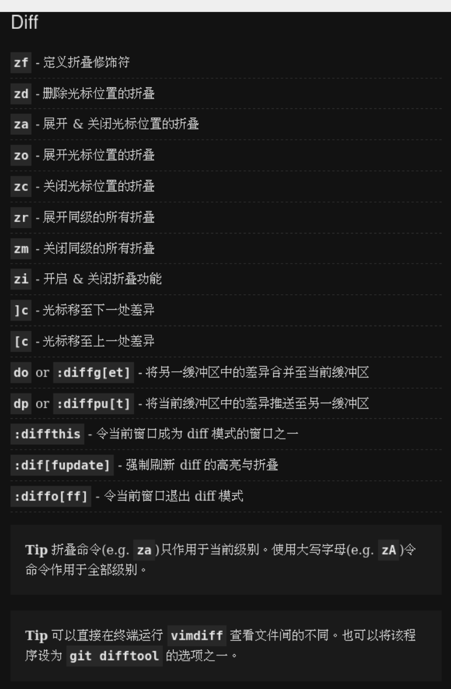
** 全局
:PROPERTIES:
:CUSTOM_ID: 63f6bdee-073d-4534-9214-723aacf30068
:END:
#+attr_org: :width 31%
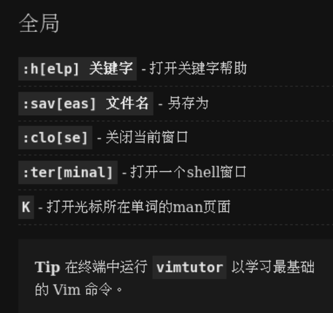
** 可视化模式命令
:PROPERTIES:
:CUSTOM_ID: 9966221b-9302-445f-af20-bb4900407d6d
:END:
#+attr_org: :width 31%

** 复制粘贴
:PROPERTIES:
:CUSTOM_ID: e417069f-beac-4c94-8492-805a08f64729
:END:
#+attr_org: :width 31%
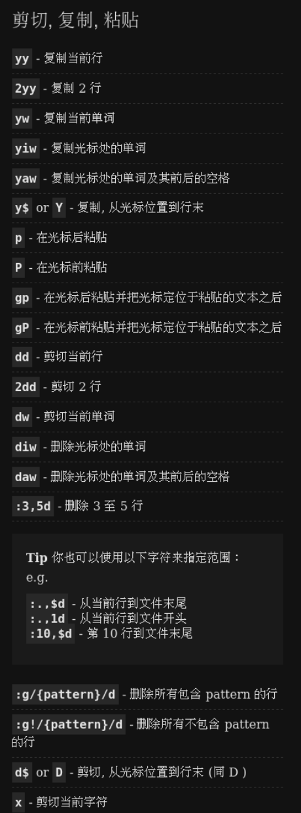
** 多文件搜索
:PROPERTIES:
:CUSTOM_ID: c7bc9aca-0b37-4d25-a62f-fc03d1380f3a
:END:
#+attr_org: :width 31%
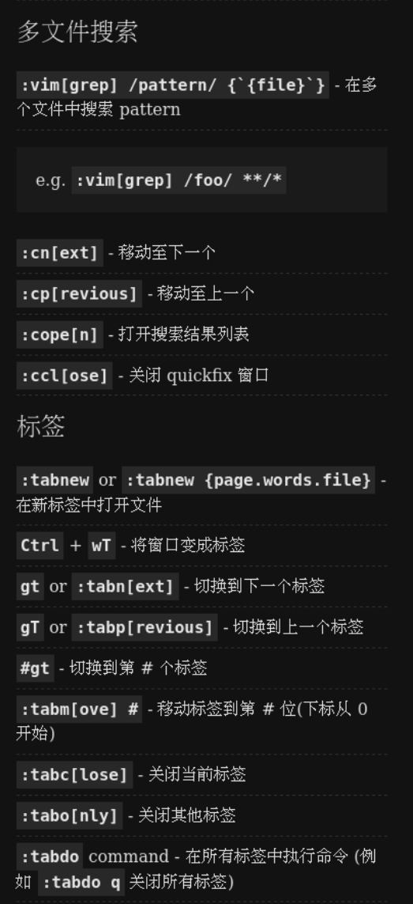
** 多文件编辑
:PROPERTIES:
:CUSTOM_ID: 4dd55017-7f89-42f6-a23c-cc804b010444
:END:
#+attr_org: :width 31%
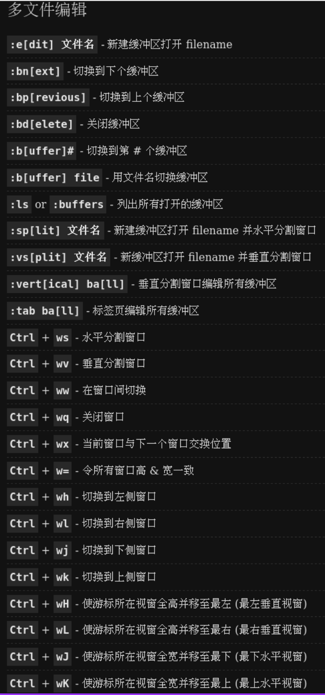
** 宏
:PROPERTIES:
:CUSTOM_ID: 894a7bba-65d9-4e54-ac50-4bae1ed65ead
:END:
#+attr_org: :width 31%

** 寄存器
:PROPERTIES:
:CUSTOM_ID: 3003b351-9139-4c87-a417-437b4bc452fd
:END:
#+attr_org: :width 31%
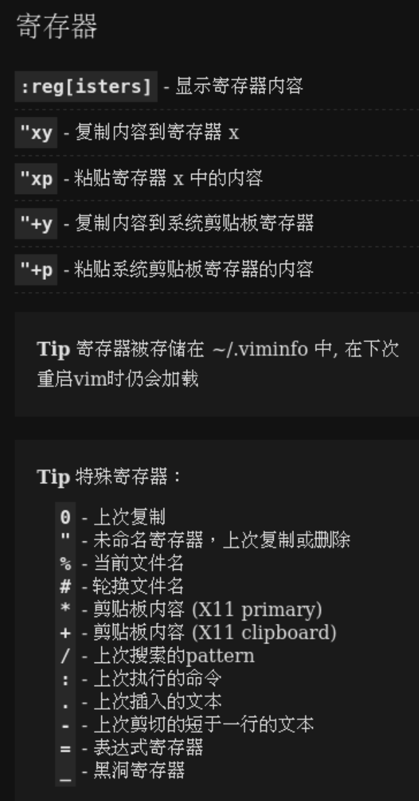
** 插入模式-插入/追加文本
:PROPERTIES:
:CUSTOM_ID: 0d749d1a-d1aa-48c1-9af8-383d71642c37
:END:
#+attr_org: :width 31%

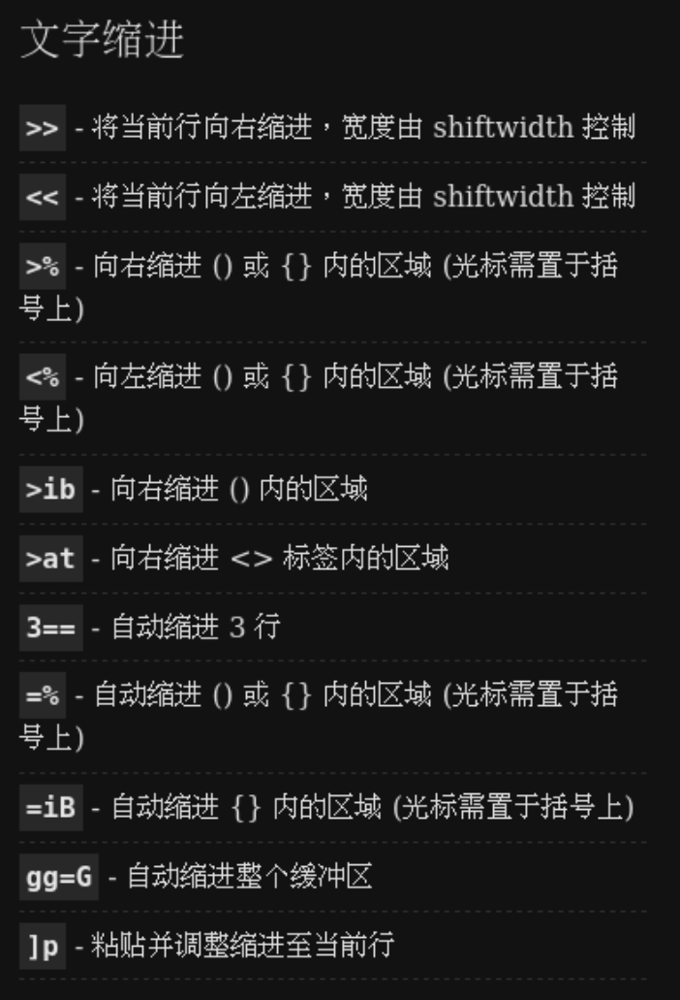
** 查找/替换
:PROPERTIES:
:CUSTOM_ID: fa95ae11-e250-42cc-af0f-a968e4e081b5
:END:
#+attr_org: :width 31%
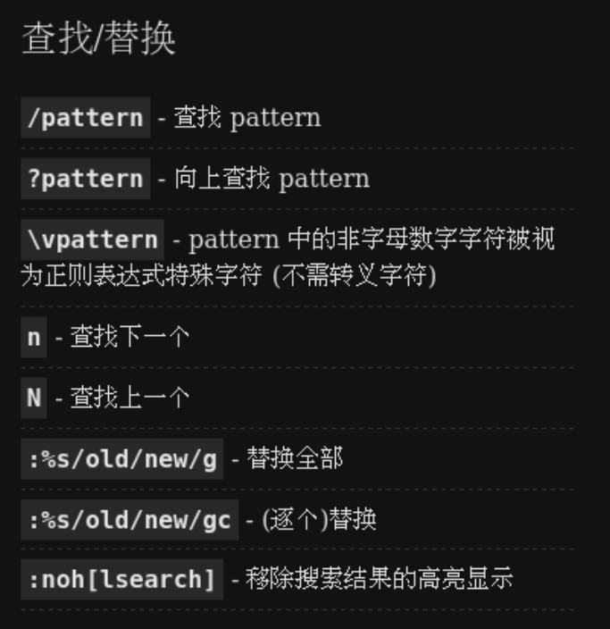
** 标记
:PROPERTIES:
:CUSTOM_ID: a86ab200-319b-4c54-b0a5-b54f59770640
:END:
#+attr_org: :width 31%
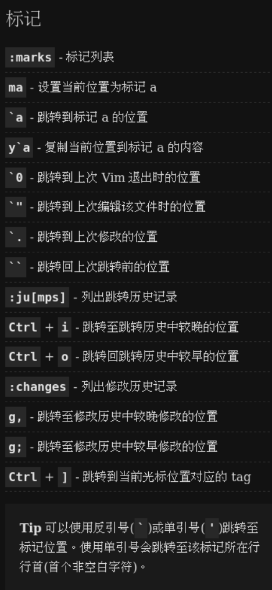
** 移动1/3
:PROPERTIES:
:CUSTOM_ID: e4a2d57b-3b5d-4cc2-89a3-b5fe24bd1fe9
:END:
#+attr_org: :width 31%

** 移动2/3
:PROPERTIES:
:CUSTOM_ID: 5fc522c5-0a41-46cf-89ce-424edde0efc2
:END:
#+attr_org: :width 31%

** 移动3/3
:PROPERTIES:
:CUSTOM_ID: bb5c3e7a-bbc2-4a02-98c7-a5396a183947
:END:
#+attr_org: :width 31%

** 编辑文本
:PROPERTIES:
:CUSTOM_ID: 7b9eb18c-e7b5-450c-a544-464f38f08f9d
:END:
#+attr_org: :width 31%
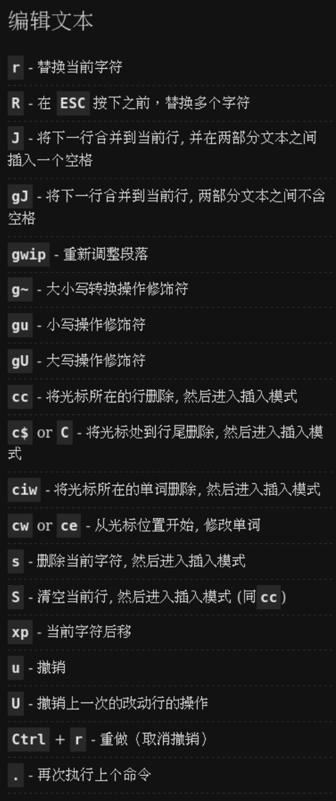
** 推出
:PROPERTIES:
:CUSTOM_ID: 10fd3cc3-d95e-4b65-b027-473901c034e9
:END:
#+attr_org: :width 31%

** 选择文本
:PROPERTIES:
:CUSTOM_ID: bf6c6e73-cde1-493a-9054-a97477110341
:END:
#+attr_org: :width 31%
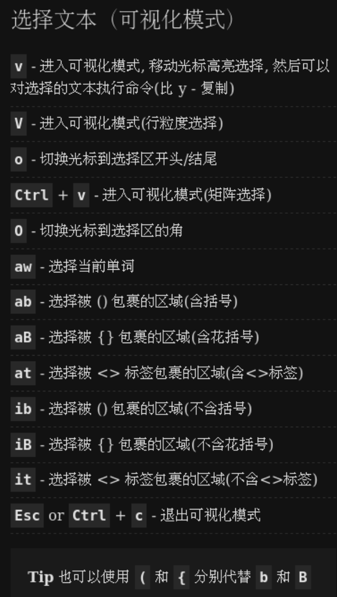
* 重装neovim前清除旧版本缓存
:PROPERTIES:
:CUSTOM_ID: b4e5cb88-58cb-4623-85b7-75bbe9e3e88f
:END:
#+begin_src sh
  #!/usr/bin/bash
  rm -rf ~/.cache/nvim
  rm -rf ~/.config/nvim
  rm -rf ~/.local/state/nvim
  rm -rf ~/.local/share/nvim
#+end_src
* nvim-spectre插件，过滤搜索结果
:PROPERTIES:
:CUSTOM_ID: 948ac2a4-cc35-4d00-a747-b9f879d845c1
:END:
#+begin_src 
path选项
,*.c         搜索结果只c文件
,*.{c,h}   搜索结果只在c和h文件
#+end_src
* 每次都弹出Please Press Enter
:PROPERTIES:
:CUSTOM_ID: 1855664c-8faa-46d2-98e0-46a2d5c0c2e7
:END:
#+begin_example
cmdheight设置为2即可，若设置为0就会出现次现象
#+end_example
* vimrc
:PROPERTIES:
:CUSTOM_ID: 68bfacf9-99a1-4d5d-826a-8bbb520603da
:END:

#+begin_src viml
"┍─────────────────────────────────────────────────────────────────────────────┑
"│                                    ★ begin vimrc ★                         │
"┕─────────────────────────────────────────────────────────────────────────────┙
"┍─────────────────────────────────────────────────────────────────────────────┑
"│                                    ★ plug ★                                 │
"┕─────────────────────────────────────────────────────────────────────────────┙
call plug#begin()

Plug 'sainnhe/everforest'
Plug 'tpope/vim-surround'
Plug 'godlygeek/tabular'
Plug 'lfv89/vim-interestingwords'
Plug 'easymotion/vim-easymotion'
Plug 'preservim/nerdtree'

call plug#end()

"┍─────────────────────────────────────────────────────────────────────────────┑
"│                       ★ how to remap keybinding ★                           │
"┕─────────────────────────────────────────────────────────────────────────────┙
"To remap commands that begin with <Plug>, you should do the following:
"
"        :{mode}map {map} <Plug>{command}
"
"For commands that do not begin with <Plug>, do:
"
"        :{mode}noremap {map} {command}
"
"where
"        `{mode}` is set to `n` for "normal" mode, `v` for "visual", and `i` for "insert"
"        `{map}` is the new key sequence of your choosing
"        `{command}` is the Vimwiki command you are remapping
"
"examples: >
"       :nmap <Leader>xx <Plug>xxxxxx
"       :vmap <Leader>xx <Plug>xxxxxx
"       :nnoremap xxx :some_cmd<CR>

"┍─────────────────────────────────────────────────────────────────────────────┑
"│                                    ★ set ★                                  │
"┕─────────────────────────────────────────────────────────────────────────────┙
"避免vi的一些反常特性
set nocompatible
let g:mapleader = ' '
set autoread
filetype on
filetype indent on
filetype plugin on
syntax on
set shortmess=atI
"disable cursor blink
set gcr+=a:blinkon0
" show cursorline highlight
set cursorline
""回删键有回删键的样子
set backspace=indent,eol,start
"比如当退出而没保存修改时提示确认
set confirm
"tab等于4个空格
set tabstop     =4
set softtabstop =4
set shiftwidth  =4
set expandtab
"换行时缩进模式
set autoindent
set cindent
"不要自动生成各种备份文件
set noswapfile
set nobackup
set noundofile
"高亮被搜索字符
set hlsearch
set history=10000
"一直显示底部状态栏,tab栏
set laststatus=2
set showtabline=0
set statusline=%F%m%r%h%w%=\ [%l\/%L:%v]
set showcmd
"编码模式，避免乱码
set fileencodings =utf-8,cp936,big5,latin1
set encoding      =utf-8
"ext命令行按tab有自动补全
set wildmenu
"光标移动时上下屏幕顶底部预留行数
set scrolloff=1
set completeopt=menu,menuone
"新建窗口出现在右边或下边
set splitright
set splitbelow
"搜索字符跳转时不循环，要么到底，要么到顶
set nowrapscan
"不自动换行
set nowrap
set tw=0
"折叠模式
set nofoldenable
"set foldmethod=indent
"set foldlevelstart=99
"不开启搜索并按行首或行尾部的设置的模式显示,
"比如vim帮助文档底部的格式字符
set nomodeline
"复制粘帖不乱缩进
set paste
"keybind超时设置
set notimeout
set ttimeout
set ttimeoutlen=10
"打开文件时不要自动跳转路径
set noautochdir
"主题
"set termguicolors
set background=dark
colorscheme everforest
" disable scrollbars
set guioptions-=r
set guioptions-=R
set guioptions-=l
set guioptions-=L

"┍─────────────────────────────────────────────────────────────────────────────┑
"│                   ★ preservim/nerdtree ★                                  │
"┕─────────────────────────────────────────────────────────────────────────────┙

"┍─────────────────────────────────────────────────────────────────────────────┑
"│                       ★ easymotion/vim-easymotion ★                         │
"┕─────────────────────────────────────────────────────────────────────────────┙
let g:EasyMotion_do_mapping = 0 " Disable default mappings
nmap s <Plug>(easymotion-overwin-f2)
let g:EasyMotion_smartcase = 1

"┍─────────────────────────────────────────────────────────────────────────────┑
"│                            ★  keybinding ★                                  │
"┕─────────────────────────────────────────────────────────────────────────────┙
noremap <silent> <Leader>e :NERDTreeToggle<CR>
"┍─────────────────────────────────────────────────────────────────────────────┑
"│                              ★ end vimrc ★                                  │
"┕─────────────────────────────────────────────────────────────────────────────┙
#+end_src
* astylerc
:PROPERTIES:
:CUSTOM_ID: d5463aeb-7929-401f-af5e-e8beaabef678
:END:

新建文件.astylerc,添加如下内容
保存后放用户根目录即可
#+begin_src rc
  --style=allman
  --align-pointer=name
  --align-reference=name
  --indent=spaces=4
  --indent-cases
  --indent-col1-comments
  --break-after-logical
  --unpad-paren
  --pad-oper
  --pad-header
  --suffix=none
#+end_src
* undotree使用
:PROPERTIES:
:CUSTOM_ID: 72f9b430-5656-43a7-9fc0-77662393cb59
:END:

打开undotree界面后，
调到侧边栏（有时间轴）
在不同的时间轴上，enter即可恢复该时间轴对应的状态。
q 退出undotree.
emacs的undotree插件一样的方法使用。
* 不用插件注释和撤销注释
:PROPERTIES:
:CUSTOM_ID: 7cb0a1c5-5931-4cb8-8edc-b479430047d9
:END:

选中几行
:norm i//
就在选中的行的前面加上了//
选中几行
:norm x   或者:norm 3x  或者:norm xxx
就删除选中的行前面的几列
* 显示文件的单词数,行数等
:PROPERTIES:
:CUSTOM_ID: 89bdfda6-317b-4492-a444-0a1d9b9a7604
:END:

g <ctrl-g>
* 输入时自动完成提示当前目录下存在的文件的文件名输入
:PROPERTIES:
:CUSTOM_ID: 3c903eca-2322-419c-86c0-05ab13629e54
:END:

ctrl-x ctrl-f
* 在vim的ext命令模式
:PROPERTIES:
:CUSTOM_ID: 8349b7af-f420-4bc5-bffa-fa7fd4b9805c
:END:

ctrl-f打开历史命令,
jk则在选项上下移动
ctrl-c关闭历史命令
若按i进入insert模式,可以继续输入ext命令，
esc则回到normal模式,jk又可以在
选项上下移动
* 修改和删除搜索的指定单词
:PROPERTIES:
:CUSTOM_ID: 4aaced9c-a577-4667-96f9-4237550a1e40
:END:

先用/搜索某个单词
一般可以按n或p来选下一个或上一个
gn配合c或d则
cgn来修改一个搜索的单词后，再不断按.来对下一个重复修改动作
dgn则类似删除
* copy line
:PROPERTIES:
:CUSTOM_ID: 5e1dbc9e-803d-47fe-be1c-9f5d80edda65
:END:

    :281t. – Copy line 281 and paste it below the current line
    :-10t. – Copy the line 10 lines above the current line and paste it below the current line
    :+8t. – Copy the line 8 lines after the current line and paste it below
    :10,20t. – Copy lines 10 to 20 and paste them below
    :t20 – Copy the current line and paste it below line 20
ex命令t用来copy行,t左边是源右边是目标位置，空就表示当前行，点表示前面数字的下一行,没有数字就表示当前行的下一行
源可以是绝对行数，相对当前行数，范围行
目标位置可以是绝对行数，相对当前行数
* 输入特殊符号
:PROPERTIES:
:CUSTOM_ID: bdff7739-c8bf-49b7-b52d-ab15460ddda4
:END:

在insert模式，ctrl-k在加2character就可以输入特殊符号，
:dig可以查看特殊符号
* :jumps	可以显示历史跳转
:PROPERTIES:
:CUSTOM_ID: 15e1f212-d058-47ae-ab98-5dc100bedf37
:END:

	:clearjumps	可以清除历史跳转
ctrl-o 后退一个jump
ctrl-i 前进一个jump
* 替换多个后显示替换记录,举例如下
:PROPERTIES:
:CUSTOM_ID: 578a1908-17d6-4ac9-ab60-1971fb75c90b
:END:

:g/MATCH/#|s/MATCH/REPLACE/g|#
10 this text will MATCH
10 this text will REPLACE
28 Excuse me, do you have any MATCHES?
28 Excuse me, do you have any REPLACEES?
* 光标形状颜色
:PROPERTIES:
:CUSTOM_ID: d1420b22-05a7-4b9c-8b34-c9104005e1a1
:END:

" Set cursor shape and color
if &term =~ "xterm"
    " INSERT mode
    let &t_SI = "\<Esc>[6 q" . "\<Esc>]12;blue\x7"
    " REPLACE mode
    let &t_SR = "\<Esc>[3 q" . "\<Esc>]12;black\x7"
    " NORMAL mode
    let &t_EI = "\<Esc>[2 q" . "\<Esc>]12;green\x7"
endif
" 1 -> blinking block  闪烁的方块
" 2 -> solid block  不闪烁的方块
" 3 -> blinking underscore  闪烁的下划线
" 4 -> solid underscore  不闪烁的下划线
" 5 -> blinking vertical bar  闪烁的竖线
" 6 -> solid vertical bar  不闪烁的竖线

其中各配置项的含义如下：
    &t_SI 表示插入模式
    &t_SR 表示替换模式
    &t_EI 表示 Normal 模式
    . 号左边的 "\<Esc>[6 q" 用来配置光标的形状。其中 6 的取值可以是 1 - 6，分别指代不同的光标样式（参考前面的注释）
    . 号右边的 "\<Esc>]12;blue\x7" 用来配置光标颜色，其中的 blue 可以替换为其他颜色名词

设置光标颜色时也可以使用 RGB 颜色，格式为 rgb:RR/GG/BB。比如纯白色的光标即为 "\<Esc>]12;rgb:FF/FF/FF\x7"。

若只想设置光标形状，直接去掉 . 号以及右边的颜色配置部分即可。如 let &t_SR = "\<Esc>[3 q"。
同理，只想修改颜色时也可以将 . 号左边的形状配置部分删掉。
. 号在这里的作用其实是字符串拼接，方便区分形状配置部分和颜色配置部分而已。去掉 . 号直接将两部分配置写在一个字符串里也是可以的。
即 let &t_SR = "\<Esc>[3 q" . "\<Esc>]12;black\x7" 等同于 let &t_SR = "\<Esc>[3 q\<Esc>]12;black\x7"
* 插件管理器plug
:PROPERTIES:
:CUSTOM_ID: aa91bd93-b820-4194-b6c9-f598aaacaaf5
:END:

 #+begin_src sh
   curl -fLo ~/.vim/autoload/plug.vim --create-dirs https://raw.githubusercontent.com/junegunn/vim-plug/master/plug.vim
 #+end_src
 更新了插件，运行PlugInstall
 重启vim
* vim-vba插件
:PROPERTIES:
:CUSTOM_ID: fdc64c6b-aa8a-4785-8cad-de02ab1328e3
:END:

** 只需用 Vim 打开， 执行一下 :so % 即可,无须用户自己找插件的安装路径。
:PROPERTIES:
:CUSTOM_ID: fd166e3d-796f-4d9e-8925-a2eea5b0d3f8
:END:

  vim someplugin.vba
  :so %
  :q
 然后插件和它的所有部件都会被安装在合适的目录里。用户无须刻意进到 某个特定的目录来执行此命令。另外，插件的帮助也会被自动安装。
** 删除 vimball 安装的插件很容易:
:PROPERTIES:
:CUSTOM_ID: 81aeae06-921d-4870-8c11-6c62fd31557e
:END:

  :RmVimball someplugin.vba
* 插件管理器pathogen
:PROPERTIES:
:CUSTOM_ID: 980e16c4-8984-48d4-823c-5b4b7c8c5687
:END:

** 安装pathogen
:PROPERTIES:
:CUSTOM_ID: 92f0da2f-dd6c-4291-b7d7-d1b7021529e0
:END:

  mkdir -p ~/.vim/autoload ~/.vim/bundle
  curl -LSso ~/.vim/autoload/pathogen.vim https://tpo.pe/pathogen.vim
  Add this to your vimrc: execute pathogen#infect()
** Now any plugins you wish to install can be extracted to a subdirectory under ~/.vim/bundle, and they will be added to the 'runtimepath'.
:PROPERTIES:
:CUSTOM_ID: d774b5a4-12f3-470f-a38d-a85de746cfa1
:END:

  或者cd ~/.vim/bundle
  git clone http://github/xxx/xxx
* 不带配置启动
:PROPERTIES:
:CUSTOM_ID: 703e0eb6-2283-4735-8605-ad449e7fc1be
:END:

1. 使用 -u 选项指定空配置
    vim -u NONE
    这会禁用 ~/.vimrc 的加载，同时也会跳过所有插件的加载。
2. 禁用插件加载
   如果你希望保留部分配置（如 ~/.vimrc），但不加载插件，可以添加 --noplugin 选项：
   vim --noplugin
   这会跳过插件目录的加载，例如 ~/.vim/plugged 或 ~/.vim/bundle。
3. 启动时完全忽略用户配置
    若希望完全忽略所有用户配置文件，可以使用以下组合：
    vim -u NONE --noplugin
4. 强制忽略系统级别配置
    如果你还需要忽略系统级配置（如 /etc/vim/vimrc），可以运行：
    vim -u NONE --noplugin --cmd 'set nocp'
        -u NONE: 不加载用户或系统的配置文件。
        --noplugin: 禁用插件。
        --cmd 'set nocp': 保证在完全无配置的情况下不进入兼容模式（compatible 模式）。
* vim :dig输出到文件
在 Vim 中，:dig（:digraphs 的简称）命令会显示可用的双字节字符映射表。如果你想将 :dig 的输出保存到文件中，可以按照以下步骤操作：
** 方法 1：使用 redir 将输出保存到文件
redir 是 Vim 提供的一个命令，用于将输出重定向到变量或文件。
    打开 Vim。
    输入以下命令：
#+begin_src C
    :redir > digraphs.txt
    :dig
    :redir END
#+end_src
:redir > digraphs.txt：将输出重定向到文件 digraphs.txt。，文件存在，会报错，不覆盖
:redir! > digraphs.txt：将输出重定向到文件 digraphs.txt。文件存在，覆盖旧的
:redir >> digraphs.txt：将输出追加重定向到文件 digraphs.txt。,不存在则创建文件
        :dig：执行 digraphs 命令，输出结果。
        :redir END：停止重定向。

    结果将被保存到当前目录下的 digraphs.txt 文件中。

** 方法 2：使用命令行直接保存输出
:PROPERTIES:
:CUSTOM_ID: aa85a39e-9fff-4541-86c6-ad9484826e69
:END:

如果你不需要在 Vim 中操作，可以直接用以下命令将 :dig 的输出保存到文件：

vim -c ':redir > digraphs.txt | dig | redir END | qa'

    -c: 指定 Vim 启动后运行的命令。
    redir > digraphs.txt: 重定向输出到文件。
    dig: 执行 digraphs 命令。
    redir END: 停止重定向。
    qa: 退出 Vim。

** 方法 3：使用 Shell 截取输出
:PROPERTIES:
:CUSTOM_ID: 82a453d5-107d-410c-a9e4-b135b27a9b6a
:END:

Vim 提供了 ex 模式，可以通过以下方式直接在 Shell 中保存 :dig 输出：

vim -es -c ':dig' -c ':qa' > digraphs.txt

    -es: 启动无交互的 Vim（silent 模式）。
    :dig: 显示 digraphs。
    :qa: 退出 Vim。
    > digraphs.txt: 将输出重定向到文件。
* mapleader和maplocalleader
:PROPERTIES:
:CUSTOM_ID: a41c60ab-9f39-44f8-aff0-6749047181c1
:END:

** 区别总结
:PROPERTIES:
:CUSTOM_ID: 7f72a078-79e6-4ae2-a444-8e8aa7e90721
:END:

|----------+-----------+----------------|
| 属性     | mapleader | maplocalleader |
|----------+-----------+----------------|
| 作用范围  | 全局      | 局部（当前缓冲区） |
|----------+-----------+----------------|
| 默认值    | \         | \              |
|----------+-----------+----------------|
| 配置优先级 | 高        | 局部可覆盖全局    |
|----------+-----------+----------------|
* gentoo 添加python支持安装vim
:PROPERTIES:
:CUSTOM_ID: ea2d9e35-e275-4d79-9851-ce261b8ab608
:END:

cd /etc/portage/package.use
sudo vim vim
添加
app-editors/vim python python3
重新编译安装
sudo emerge --update --newuse app-editors/vim
* vim 自动更行ctags
:PROPERTIES:
:CUSTOM_ID: 63a5920a-f22c-4bb2-8419-27eb64656a28
:END:

** 安装 ctags
:PROPERTIES:
:CUSTOM_ID: a91373b9-9f69-4678-ab2e-1ad31ed122da
:END:

安装示例（以 Ubuntu 为例）：

sudo apt install universal-ctags

** 配置 Vim 自动更新 ctags
:PROPERTIES:
:CUSTOM_ID: 1aa8126c-fd06-41e9-a5d6-43ece864f8a7
:END:

*** 方式一：在 Vim 配置文件中添加自动命令
:PROPERTIES:
:CUSTOM_ID: ab0d2358-ca91-4fb0-81f2-2012865aa84d
:END:

#+begin_src sh
  在你的 Vim 配置文件（通常是 ~/.vimrc 或 ~/.config/nvim/init.vim）中添加以下代码：

  " 保存时自动更新 ctags
  autocmd BufWritePost * call UpdateCtags()

  function! UpdateCtags()
      let tags_file = finddir('.git', '.;') . '/../tags'
      if !empty(finddir('.git', '.;')) && filereadable(tags_file)
          execute 'silent! !ctags -R .'
      endif
  endfunction

  这个配置会在每次保存文件时，检查是否有 .git 目录，并在项目根目录下运行 ctags -R。
#+end_src
*** 方式二：结合插件管理工具
:PROPERTIES:
:CUSTOM_ID: e35c932c-a288-421f-91c3-c20fbf83f77d
:END:

#+begin_src sh
  安装 gutentags 的插件，自动管理和更新 ctags。

  配置 vim-gutentags：

      let g:gutentags_project_root = ['.git', '.hg', '.svn', '.project']
      let g:gutentags_ctags_extra_args = ['--fields=+l', '--c++-kinds=+p', '--c-kinds=+p']
      let g:gutentags_generate_on_write = 1
      let g:gutentags_cache_dir = expand('~/.cache/tags')
#+end_src
* vim-autoformat插件使用astyle
:PROPERTIES:
:CUSTOM_ID: 45509336-cffc-4796-96ef-b72629faf525
:END:
** 安装 astyle
:PROPERTIES:
:CUSTOM_ID: e94e4035-ad47-4c1b-a7b8-680db0a80d9b
:END:

    在系统中安装 astyle。如果你使用的是 Linux 或 macOS，可以通过包管理器安装它：
        Ubuntu/Debian：

sudo apt-get install astyle

macOS（使用 Homebrew）：

        brew install astyle

    如果你在 Windows 上，可以从 AStyle 官方网站 下载并安装它。
** 配置 vim-autoformat 使用 astyle
:PROPERTIES:
:CUSTOM_ID: 807c8177-b25a-4d81-a43f-74cfee0545dd
:END:

#+begin_src sh
  首先，确保你已经安装了 vim-autoformat 插件。可以通过插件管理器（如 vim-plug）安装：

  Plug 'Chiel92/vim-autoformat'

  安装完成后，你可以在 Vim 中配置 vim-autoformat 来使用 astyle 格式化 C/C++ 代码。

  在你的 .vimrc 或 init.vim 中添加以下配置：

  let g:autoformat_autoindent = 1
  let g:autoformat_formats = {
      \ 'cpp': ['astyle'],
      \ 'c': ['astyle'],
      \ }

  " 配置 astyle 的选项
  let g:autoformat_astyle_options = '--style=allman --indent=spaces=4'

  这段代码做了以下事情：

      设置 cpp 和 c 文件使用 astyle 格式化。
      设置 astyle 的选项（例如：--style=allman 用于 Allman 风格，--indent=spaces=4 用于 4 个空格缩进，你可以根据需要调整这些选项）。

  在 Vim 中，使用以下命令来格式化文件：

      :Autoformat
#+end_src
* debian12源码安装vim
:PROPERTIES:
:CUSTOM_ID: 004fb812-7576-40b4-b5bc-e65a9083ef49
:END:

#+begin_src sh
  在 Debian 12 上从源码安装 Vim 通常需要以下步骤：
  步骤 1: 安装必要的依赖

  在编译 Vim 之前，你需要安装一些编译所需的软件包。

  sudo apt update
  sudo apt install -y git gcc make ncurses-dev libperl-dev python3-dev ruby-dev lua5.4 liblua5.4-dev

  步骤 2: 获取 Vim 源码

  从 Vim 的官方 Git 仓库克隆源码：

  git clone https://github.com/vim/vim.git
  cd vim

  如果只想下载某个稳定版本，可以切换到对应的分支或 tag，例如：

  git checkout v9.0.0000  # 示例版本号

  步骤 3: 配置和编译

  运行以下命令配置 Vim 的编译选项：

  ./configure --with-features=huge \
              --enable-multibyte \
              --enable-python3interp \
              --enable-rubyinterp \
              --enable-perlinterp \
              --enable-luainterp \
              --enable-cscope \
              --prefix=/usr/local

  解释：

      --with-features=huge：启用 Vim 的所有功能。
      --enable-*interp：支持 Python、Ruby、Perl 和 Lua 语言。
      --prefix=/usr/local：安装路径为 /usr/local。

  然后编译 Vim：

  make -j$(nproc)

  步骤 4: 安装

  以管理员权限安装：

  sudo make install

  步骤 5: 验证安装

  检查 Vim 是否正确安装：

  vim --version

  你应该会看到 Vim 的版本信息，以及启用的功能（如 +python3、+lua）。
  可选步骤: 替换系统默认的 Vim

  如果你希望从源码安装的 Vim 替换系统自带的版本，可以通过以下命令更新 /usr/bin/vim 的软链接：

  sudo update-alternatives --install /usr/bin/vim vim /usr/local/bin/vim 1
  sudo update-alternatives --config vim

  按提示选择刚安装的 Vim 路径即可。
  常见问题
      缺少依赖错误
      如果编译时提示缺少某些依赖，确保所有必要的软件包都已安装，特别是 ncurses-dev 和语言相关的开发包。
      权限不足
      如果 make install 提示权限不足，确保使用了 sudo。
#+end_src
* vim插件UltiSnips 使用
:PROPERTIES:
:CUSTOM_ID: cafd49e9-c32d-4fc1-ad14-64572eece3a4
:END:
** 安装 UltiSnips
:PROPERTIES:
:CUSTOM_ID: 0b1f276e-bd60-4a5e-a767-eab2ebbb3b8e
:END:
#+begin_src sh
  UltiSnips 通常和 vim-plug 一起使用进行插件管理，以下是安装方法：
  (1) 安装,github clone 到~/.vim/bundle里

  'SirVer/ultisnips'             " 安装 UltiSnips
  'honza/vim-snippets'           " 安装社区共享代码片段

  (2) 配置 vimrc

  let g:UltiSnipsExpandTrigger="<Tab>"  " 设置触发展开的按键
  let g:UltiSnipsJumpForwardTrigger="<C-j>"  " 跳到下一个占位符
  let g:UltiSnipsJumpBackwardTrigger="<C-k>" " 跳到上一个占位符

#+end_src
** 基本用法
:PROPERTIES:
:CUSTOM_ID: d4cafd4d-3d49-4b7e-8e59-5022a726fb9e
:END:
#+begin_example
(1) 添加自定义片段

UltiSnips 的片段文件通常存放在 ~/.vim/UltiSnips/ 目录下。每种语言都有单独的片段文件，例如 python.snippets 或 html.snippets。

创建或编辑一个片段文件：

mkdir -p ~/.vim/UltiSnips
vim ~/.vim/UltiSnips/python.snippets

然后添加自定义片段，例如：

snippet def "Python Function"
def ${1:function_name}(${2:args}):
    ${3:pass}
endsnippet

    snippet：定义片段的开始，后面是片段的触发关键字。
    ${1}、${2}：占位符，按触发键 <C-j> 或 <C-k> 在它们之间跳转。
    endsnippet：定义片段的结束。

保存后，在 Python 文件中输入 def 并按 <Tab>，片段会自动展开。
(2) 使用现成的片段

安装 vim-snippets 后，可以直接使用社区共享的代码片段。例如，在 HTML 文件中输入 html 并按 <Tab> 会插入一个 HTML 基本结构。
(3) 跳转和编辑

    跳转到下一个占位符：按 <C-j>。
    跳转到上一个占位符：按 <C-k>。
    编辑当前占位符：直接修改占位符内容。
#+end_example
** 高级功能
:PROPERTIES:
:CUSTOM_ID: bcabc55b-fa15-4736-9699-602c4cb77b0d
:END:
#+begin_example
(1) 动态片段

UltiSnips 支持动态内容，例如根据条件生成片段内容：

snippet today "Insert today's date"
`!v strftime("%Y-%m-%d")`
endsnippet

输入 today 并展开时，会插入当天的日期。
(2) 嵌套片段

UltiSnips 支持片段嵌套，展开一个片段后可以继续在其中触发其他片段。
(3) 条件片段

可以根据文件类型或上下文定义条件片段。例如，只在 Python 文件中使用某些片段：

snippet class "Python Class" b
class ${1:ClassName}:
    def __init__(self, ${2:args}):
        ${3:pass}
endsnippet

这里的 b 表示只有在 python 文件类型中有效。
#+end_example
** 常见问题
:PROPERTIES:
:CUSTOM_ID: e77e6d7a-4dd9-4eca-8a70-2e645a523e9a
:END:
#+begin_example
(1) 片段无法触发

    检查 UltiSnips 是否正确加载：:echo g:UltiSnipsExpandTrigger 应显示 <Tab> 或其他触发键。
    确保当前文件类型和片段文件匹配，例如 Python 文件需要对应 python.snippets。

(2) 与其他插件冲突

如果使用了其他插件（如 YouCompleteMe）也占用了 <Tab> 键，可以更改触发键：

let g:UltiSnipsExpandTrigger="<C-l>"

UltiSnips 是一个高度可定制的插件，结合社区提供的片段和自定义片段，能够极大提高工作效率！如果还有其他问题，欢迎继续咨询！
#+end_example
** 添加C片段 具体demo
:PROPERTIES:
:CUSTOM_ID: 3d780984-00d2-4067-886b-156a74419222
:END:
#+begin_src sh
  以下是为 C 语言添加代码片段的具体示例，以及如何使用它们的操作指南。
  1. 创建 C 语言的片段文件

  首先，在 ~/.vim/UltiSnips/ 目录下创建一个 c.snippets 文件：

  mkdir -p ~/.vim/UltiSnips
  vim ~/.vim/UltiSnips/c.snippets

  2. 添加常用片段
  (1) 基本结构片段

  snippet main "Main Function"
  #include <stdio.h>

  int main() {
      ${1:// Your code here}
      return 0;
  }
  endsnippet

  在 C 文件中输入 main 并按 <Tab>，会展开为：

  #include <stdio.h>

  int main() {
      // Your code here
      return 0;
  }

  占位符 ${1} 会高亮，你可以直接编辑。
  (2) 条件判断

  snippet if "If Statement"
  if (${1:condition}) {
      ${2:// code}
  }
  endsnippet

  输入 if 并按 <Tab>，会展开为：

  if (condition) {
      // code
  }

  你可以快速编辑条件和代码块。
  (3) 循环结构

  snippet for "For Loop"
  for (int ${1:i} = 0; ${1:i} < ${2:limit}; ${1:i}++) {
      ${3:// code}
  }
  endsnippet

  输入 for 并按 <Tab>，会展开为：

  for (int i = 0; i < limit; i++) {
      // code
  }

  通过 <C-j> 可以快速跳转和编辑占位符。
  (4) 函数定义

  snippet func "Function Definition"
  ${1:void} ${2:function_name}(${3:void}) {
      ${4:// code}
  }
  endsnippet

  输入 func 并按 <Tab>，会展开为：

  void function_name(void) {
      // code
  }

  (5) 打印调试信息

  snippet debug "Debug Print"
  printf("DEBUG: ${1:message}\\n");
  ${2:}
  endsnippet

  输入 debug 并按 <Tab>，会展开为：

  printf("DEBUG: message\n");

  3. 使用片段

      创建或打开一个 .c 文件。
      输入片段的触发关键字（如 main、if、for 等）。
      按 <Tab> 触发片段展开。
      使用 <C-j> 或 <C-k> 在占位符之间跳转并填写内容。

  4. 验证片段是否生效

  确保 Vim 正确加载片段文件，运行以下命令：

  :UltiSnipsEdit c

  这将打开对应的 c.snippets 文件，检查片段内容是否正确。编辑后保存并关闭，新的片段即可生效。
  5. 扩展片段功能

  你可以根据需求添加更多动态或复杂的片段。例如：
  动态片段：获取当前时间戳

  snippet timestamp "Insert Timestamp"
  printf("Timestamp: %ld\\n", time(NULL));
  endsnippet

  多行注释模板

  snippet comment "Block Comment"
  /*
   ,* ${1:Description}
   ,* Author: ${2:Your Name}
   ,* Date: `!v strftime("%Y-%m-%d")`
   ,*/
  ${3:}
  endsnippet

  输入 comment 并按 <Tab>，会展开为：

  /*
   ,* Description
   ,* Author: Your Name
   ,* Date: 2025-01-02
   ,*/

  UltiSnips 的灵活性可以满足大多数开发需求，尤其是在需要高效重复输入代码的场景中。如果有特定的 C 功能片段需求，可以进一步自定义！
#+end_src

<<<<<<< HEAD
* vim diff用法
:PROPERTIES:
:CUSTOM_ID: 9970bd74-4af1-4d76-9004-cc3b3a0e3070
:END:

#+begin_src sh
  在使用 vim 时，diff 模式可以非常方便地对比两个或多个文件的差异。以下是关于 vim diff 的常见用法和技巧：
  基本用法

      比较两个文件：

  vimdiff file1 file2

  或者：

  vim -d file1 file2

  比较多个文件（支持 3 路或更多文件比较）：

  vimdiff file1 file2 file3

  在打开的 Vim 中启动 diff 模式： 如果已经打开 Vim，可以在命令模式下输入：

      :vert diffsplit file2

      这会在垂直分屏中加载 file2 并进入 diff 模式。

  常用快捷键

      导航差异块：
          [c：跳到上一个差异块。
          ]c：跳到下一个差异块。

      同步窗口滚动： 窗口默认是同步滚动的。如果不同步，可以输入：

  :syncbind

  应用差异：

      do（diff obtain）：获取其他窗口的差异到当前窗口。
      dp（diff put）：将当前窗口的内容应用到其他窗口。

  更新 diff： 如果手动修改了内容，可以刷新 diff：

  :diffupdate

  关闭 diff 模式：

      :diffoff

  窗口管理

      切换窗口：使用 <Ctrl-w> w 或 <Ctrl-w> <方向键>。
      调整窗口大小：
          垂直分屏：<Ctrl-w> < 或 <Ctrl-w> >。
          水平分屏：<Ctrl-w> - 或 <Ctrl-w> +。

  配置优化

      设置配色： 默认情况下，diff 使用的颜色可能不够清晰。可以通过设置高亮来改善可读性：

  :hi DiffAdd    ctermbg=green guibg=green
  :hi DiffChange ctermbg=blue  guibg=blue
  :hi DiffDelete ctermbg=red   guibg=red

  忽略空白差异： 如果希望忽略空格或缩进的差异：

  :set diffopt+=iwhite

  显示行号：

      :set number

  扩展工具

      如果你觉得 Vim 自带的 diff 不够强大，可以结合 diff 工具（如 git diff）预处理文件后再用 vimdiff 查看。

      在 Git 中直接使用 vimdiff：

      git difftool -t vimdiff
#+end_src
* nerdcommenter插件快捷键
:PROPERTIES:
:CUSTOM_ID: 53c2f5a2-285e-478e-955a-bf14c44a0874
:END:

 #+begin_src sh
   The following key mappings are provided by default (there is also a menu provided that contains menu items corresponding to all the below mappings):

   Most of the following mappings are for normal/visual mode only. The |NERDCommenterInsert| mapping is for insert mode only.

       [count]<leader>cc |NERDCommenterComment|

       Comment out the current line or text selected in visual mode.

       [count]<leader>cn |NERDCommenterNested|

       Same as cc but forces nesting.

       [count]<leader>c<space> |NERDCommenterToggle|

       Toggles the comment state of the selected line(s). If the topmost selected line is commented, all selected lines are uncommented and vice versa.

       [count]<leader>cm |NERDCommenterMinimal|

       Comments the given lines using only one set of multipart delimiters.

       [count]<leader>ci |NERDCommenterInvert|

       Toggles the comment state of the selected line(s) individually.

       [count]<leader>cs |NERDCommenterSexy|

       Comments out the selected lines with a pretty block formatted layout.

       [count]<leader>cy |NERDCommenterYank|

       Same as cc except that the commented line(s) are yanked first.

       <leader>c$ |NERDCommenterToEOL|

       Comments the current line from the cursor to the end of line.

       <leader>cA |NERDCommenterAppend|

       Adds comment delimiters to the end of line and goes into insert mode between them.

       |NERDCommenterInsert|

       Adds comment delimiters at the current cursor position and inserts between. Disabled by default.

       <leader>ca |NERDCommenterAltDelims|

       Switches to the alternative set of delimiters.

       [count]<leader>cl |NERDCommenterAlignLeft [count]<leader>cb |NERDCommenterAlignBoth

       Same as |NERDCommenterComment| except that the delimiters are aligned down the left side (<leader>cl) or both sides (<leader>cb).

       [count]<leader>cu |NERDCommenterUncomment|

       Uncomments the selected line(s).
 #+end_src
* set paste
:PROPERTIES:
:CUSTOM_ID: 10462f24-ba79-44f7-8741-ee9ecf50915f
:END:

#+begin_src sh
** 命令启用
:PROPERTIES:
:CUSTOM_ID: 8addd006-fadb-4df8-bd54-04e8ee8e04c4
:END:

      手动执行以下命令：

      :set paste

      启用后，状态栏中通常会显示 -- INSERT (paste) --，表示已经进入 Paste 模式。

**   快捷键启用
:PROPERTIES:
:CUSTOM_ID: 93cabb70-5663-46d1-9be2-98373a9faaa6
:END:

      可以使用 pastetoggle 设置一个快捷键切换 Paste 模式。例如：

          set pastetoggle=<F2>

          按下 F2 即可快速启用或关闭 Paste 模式。

** Paste 模式的应用场景
:PROPERTIES:
:CUSTOM_ID: d9b5d9d9-f7b3-4978-a947-0846646a3032
:END:

      从外部复制粘贴文本
          例如从浏览器、终端或其他编辑器中复制代码粘贴到 Vim 中。
          避免格式问题，如多余的缩进或不正确的换行。

      避免映射干扰
          如果插入模式下某些按键（如 <Tab>）有特殊映射，Paste 模式会禁用这些映射，确保粘贴内容保持原样。

**  如何退出 Paste 模式
:PROPERTIES:
:CUSTOM_ID: 78ca8367-7a98-4fa3-b4a3-7cae9b5d21e4
:END:

      手动关闭
          执行以下命令：

          :set nopaste

      快捷键切换
          如果配置了 pastetoggle，再次按下快捷键即可关闭 Paste 模式。

**  如何知道当前是否处于 Paste 模式
:PROPERTIES:
:CUSTOM_ID: 31f695bc-e9b4-4ec4-aa97-aaf13db7544e
:END:

      查看状态栏
          如果状态栏显示 -- INSERT (paste) --，则表示当前处于 Paste 模式。
          如果没有此提示，Paste 模式未启用。

      检查选项
          使用以下命令检查当前 Paste 模式是否启用：

  :set paste?

  如果显示 paste，说明 Paste 模式启用；如果显示 nopaste，说明未启用。
#+end_src
=======
* vim双引号寄存器作用
:PROPERTIES:
:CUSTOM_ID: 290ca730-7f44-4cfd-9ba1-da478e175a24
:END:

#+begin_src sh
  在 Vim 中，双引号寄存器（"）被称为“默认寄存器”或“未命名寄存器”。它的主要作用是自动存储最近一次的复制（yank）、删除（delete）、或更改（change）的内容。
  使用场景和规则

      复制操作（y）
          当你使用 y 命令复制内容时，复制的文本会自动存储到默认寄存器（"）中。
          示例：
              执行 yw（复制一个单词），内容存储到 " 中。

      删除操作（d）
          当你删除内容时，删除的文本也会被存储到默认寄存器中，除非你使用黑洞寄存器（"_）覆盖此行为。
          示例：
              执行 dd（删除一行），被删除的行会存储到 " 中。

      更改操作（c）
          更改命令（例如 cw）会先删除内容，因此被删除的文本也会存储到默认寄存器中。

      粘贴操作（p 和 P）
          默认情况下，p 和 P 命令会从默认寄存器（"）中粘贴内容。

      直接使用默认寄存器
          即使不明确指定 "，默认寄存器始终是隐式使用的。例如：

          "p

          与普通的 p 是等效的。

  与其他寄存器的关系

      默认寄存器的内容会被许多操作覆盖，因此需要频繁使用其他命名寄存器（如 "a 到 "z）来保存重要内容。
      如果只想删除内容而不覆盖默认寄存器，可以使用黑洞寄存器（"_），例如：

      "_d

#+end_src
* quickfix和locallist区别
:PROPERTIES:
:CUSTOM_ID: 6ea9b792-15be-490a-92a0-e005659bbcc1
:END:

** 在 Neovim 和 Vim 中，quickfix 和 location list 是两种用于显示和导航错误、警告或搜索结果的窗口。 它们的主要区别在于作用范围和使用场景：
:PROPERTIES:
:CUSTOM_ID: 9894f420-2f7a-47f5-8ad9-242c0f8624db
:END:

** 1. Quickfix List (快速修复列表)
:PROPERTIES:
:CUSTOM_ID: 642b3a37-1ee3-4ce6-8d2e-88fd3cec90e5
:END:

*** 作用范围：全局
:PROPERTIES:
:CUSTOM_ID: ff177ba6-4b7a-4c56-932e-ca317b7e8cac
:END:

      Quickfix 列表是全局的，适用于整个 Neovim 实例。它的内容可以来自不同的文件，适合跨文件的操作，比如运行编译器、搜索整个项目或执行多文件替换时生成的结果。

*** 打开方式：
:PROPERTIES:
:CUSTOM_ID: c9c62d3f-cee9-47db-923a-5008a86d6b13
:END:

      使用 :copen 打开 Quickfix 窗口，:cclose 关闭，:cnext 和 :cprev 在列表中跳转。

**** 典型用途：
:PROPERTIES:
:CUSTOM_ID: 70344b70-dadd-4275-a1a7-14b1513e5fb9
:END:

    - 通过 :make 查看编译错误。
    - 使用 :grep 或 :vimgrep 搜索多个文件中的内容。

** 2. Location List (局部列表)
:PROPERTIES:
:CUSTOM_ID: 22475078-a4c2-4a0e-920a-e7c6c1db02b3
:END:

***    作用范围：局部（窗口相关）
:PROPERTIES:
:CUSTOM_ID: 7335f099-63f6-4d4a-8e37-771a4ad92361
:END:

**** Location List 是局部的，与某个特定的窗口绑定。每个窗口都有独立的 Location List，内容通常是该窗口中相关操作的结果。
:PROPERTIES:
:CUSTOM_ID: 9edf4e12-2805-4856-94b5-466f24aae7e6
:END:

***    打开方式：
:PROPERTIES:
:CUSTOM_ID: c92aa3f9-2d5b-49ac-b6a2-0f6204a7fd91
:END:

**** 使用 :lopen 打开 Location List，:lclose 关闭，:lnext 和 :lprev 在列表中跳转。
:PROPERTIES:
:CUSTOM_ID: d977bda6-221c-4a15-8a1b-c9ef2c4d231f
:END:

***   典型用途：
:PROPERTIES:
:CUSTOM_ID: ac1c2d8f-47a7-440b-aac7-10032880002f
:END:

**** 检查当前文件的语法或拼写错误（比如 LSP 提供的诊断信息）。
:PROPERTIES:
:CUSTOM_ID: 84683f8b-19e5-4254-b8a9-cbfe10f7cc43
:END:

**** 与窗口绑定的操作，比如某些插件生成的结果。
:PROPERTIES:
:CUSTOM_ID: f7477a25-d63a-4b6a-9f07-e41b6d842925
:END:

** 3. 具体区别对比
:PROPERTIES:
:CUSTOM_ID: be9ae482-cf40-4f14-977a-7833b7408eff
:END:

|---------+----------------------+-------------------------|
| 特性    | Quickfix List        | Location List           |
|---------+----------------------+-------------------------|
| 作用范围 | 全局（跨文件）          | 局部（当前窗口）           |
|---------+----------------------+-------------------------|
| 打开方式 | :copen               | :lopen                  |
|---------+----------------------+-------------------------|
| 结果来源 | 多文件操作（如编译、搜索） | 当前窗口相关的操作（如 LSP） |
|---------+----------------------+-------------------------|
| 独立性   | 所有窗口共享一个列表     | 每个窗口有独立的列表        |
|---------+----------------------+-------------------------|
| 适用场景 | 项目范围的任务          | 局部错误或问题检查          |
|---------+----------------------+-------------------------|
** 4. 示例
:PROPERTIES:
:CUSTOM_ID: 1f3390d6-2e66-4731-babf-b425a27c31fb
:END:

*** 使用 Quickfix List：
:PROPERTIES:
:CUSTOM_ID: 1c0c41a2-ef5b-41e0-a8aa-9aee511cc343
:END:

#+begin_src sh
  :grep "TODO" **/*.c
  :copen
  搜索项目中的 TODO 注释，并在 Quickfix 窗口中显示结果。
#+end_src

*** 使用 Location List：
:PROPERTIES:
:CUSTOM_ID: 582b86ef-d1c4-405c-b29f-6f841e2f65c0
:END:

  #+begin_src sh
  :lopen
  打开当前窗口相关的 Location List，显示 LSP 或插件生成的诊断信息。
  #+end_src

** 总之，如果你需要跨文件查看结果，使用 Quickfix；如果只关心当前文件或窗口的内容，使用 Location List 更合适。
:PROPERTIES:
:CUSTOM_ID: ed4acff5-e506-4f6c-b53b-4975c5028c31
:END:
* vim自带插件管理功能
:PROPERTIES:
:CUSTOM_ID: b3e79739-eb0d-459a-aa47-3b8545a53ffe
:END:
** Pathogen
:PROPERTIES:
:CUSTOM_ID: ddee0188-8090-4da0-bcfa-5c0df44b9553
:END:
#+begin_src
    Pathogen 是一个第三方插件管理工具，可以让你更方便地管理 Vim 插件，每个插件都可以独立存放在 ~/.vim/bundle/目录中。
    兼容vim7及更高版本
#+end_src
#+begin_src sh
    mkdir -p ~/.vim/autoload ~/.vim/bundle && curl -LSso ~/.vim/autoload/pathogen.vim https://tpo.pe/pathogen.vim
#+end_src
#+begin_src
    在 ~/.vimrc中添加：

    execute pathogen#infect()
    syntax on
    filetype plugin indent on
#+end_src
#+begin_src
    安装插件只需将其克隆到 ~/.vim/bundle/ 目录,比如：
#+end_src
#+begin_src sh
    git clone https://github.com/preservim/nerdtree.git ~/.vim/bundle/nerdtree
#+end_src
** Vim 自带的插件管理
:PROPERTIES:
:CUSTOM_ID: 23e05b2c-f288-4cdc-805c-a4702e828aad
:END:
#+begin_src
    Vim8 及更高版本提供了原生的 packpath 插件管理方式，类似于 Pathogen，但无需额外安装插件管理器。
    插件目录结构
    Vim 8/Neovim 的插件应该放在 pack/*/start/ 目录。例如：
#+end_src
#+begin_src sh
    mkdir -p ~/.vim/pack/plugins/start
#+end_src
#+begin_src
    安装插件与Pathogen 类似，只需克隆到 pack/plugins/start/ 目录比如：
#+end_src
#+begin_src
    git clone https://github.com/preservim/nerdtree.git ~/.vim/pack/plugins/start/nerdtree
#+end_src
#+begin_src
    Vim 会自动加载 start/ 目录中的插件。
#+end_src
** 选择
:PROPERTIES:
:CUSTOM_ID: 5c553603-9465-4658-949f-23c7945d947e
:END:
#+begin_src
    如果你使用 Vim 8 及更高版本，建议直接使用 Vim 自带的插件管理方式，无需额外安装 Pathogen。
    如果你使用的是 Vim 7，可以使用 Pathogen。
#+end_src
** Vim 8 自带插件管理目录 ~/.vim/pack/plugins/start和~/.vim/pack/plugins/opt
:PROPERTIES:
:CUSTOM_ID: fa6fdfa7-d016-42e1-a4c0-8572d1e1326f
:END:
#+begin_src
    在 Vim 8 及更高版本中，插件可以按照“包（package）”的机制进行管理。通常的目录结构如下：

    ~/.vim/pack/plugins/
    ├── start/   # 自动加载的插件
    └── opt/     # 可选（延迟加载）的插件

    下面详细说明这两个目录的区别和用途：
    1. ~/.vim/pack/plugins/start/ —— 自动加载的插件

        加载时机：
        Vim 启动时会自动加载 start/ 目录下的所有插件，不需要手动调用加载命令。

        用途：
        适用于那些你希望在 Vim 启动时就立即可用的插件，比如状态栏插件、文件浏览器、高亮插件等。

        目录结构：
        每个插件通常单独放在一个文件夹内，例如：

        ~/.vim/pack/plugins/start/
        ├── nerdtree/
        ├── vim-airline/
        └── fzf.vim/

        插件中的脚本文件（通常在各自的 plugin/、autoload/、doc/ 等目录内）会在 Vim 启动过程中按照默认的 runtimepath 规则加载。

        优点：
        由于无需额外加载命令，这里的插件始终可用。

    2. ~/.vim/pack/plugins/opt/ —— 可选（延迟加载）的插件

        加载时机：
        opt/ 目录下的插件不会在 Vim 启动时自动加载，而是需要你在需要时使用命令手动加载，例如：

    :packadd 插件名

    或者通过在 vimrc 中设置自动命令来按需加载。

    用途：
    适用于那些使用频率较低或只在特定情境下需要的插件，比如某些特定文件类型下才用到的插件。这样可以减少 Vim 的启动时间，提高整体性能。

    目录结构：
    每个插件同样放在一个单独的文件夹内，例如：

        ~/.vim/pack/plugins/opt/
        ├── vim-surround/
        └── vim-fugitive/

        当你使用 :packadd vim-surround 后，Vim 会将 vim-surround 插件的相关脚本加入到运行环境中。

        优点：
        延迟加载可以避免不常用插件在启动时占用资源，提升启动速度。

    额外说明

        手动加载所有 opt 插件：
        如果你希望在某些情况下一次性加载 opt/ 目录下的所有插件，可以在 vimrc 中使用：

        packloadall

        但这样做会失去 opt 插件延迟加载的优势。

        目录名称“plugins”：
        这里的 plugins 是自定义的分组名称，你可以根据需要使用其它名称，比如 bundle、myplugins 等，只要在 ~/.vim/pack/ 下有相应的子目录即可。

        查看已加载脚本：
        你可以使用 :scriptnames 命令查看 Vim 启动后加载的所有脚本，确认哪些插件已经加载。

    总结

        start/：
            自动加载：Vim 启动时自动加载其中所有插件。
            适用场景：常用、需要即时使用的插件。

        opt/：
            手动加载：需要时通过 :packadd 命令或自动命令加载。
            适用场景：不常用或只在特定条件下需要的插件，能帮助提高启动速度。

    这种包管理机制使得用户能够灵活地管理插件加载，既保证常用插件随时可用，又可以延迟加载不常用插件以提高性能。
#+end_src
* 每个tab设置不同cwd
:PROPERTIES:
:CUSTOM_ID: d1677e60-a638-40a0-bea7-4d91f76c3da9
:END:
#+begin_example
使用:tcd <folder>
#+end_example
* guicursor
:PROPERTIES:
:CUSTOM_ID: 6eba6c03-68ad-4308-9ea2-aee36c91ff2b
:END:
#+begin_example
To change your cursor in Neovim, see help for guicursor: :h guicursor.
To change your cursor (block by default) to underline (horizontal line) for all modes: set guicursor=a:hor20.
If you prefer a cursor with a vertical line as shape: set guicursor=a:ver20
#+end_example
* 表达式寄存器
:PROPERTIES:
:CUSTOM_ID: 8401bef5-6361-4f94-b9ff-f7c30f0fca55
:END:
#+begin_example
表达式寄存器
在 Vim / Neovim 中，表达式寄存器（expression register） 是寄存器 =。它允许在编辑时 即时计算表达式并把结果插入文本。
基本机制：
当输入 Ctrl-r = 时，Vim 会打开一个小命令行，让你输入 Vimscript 表达式。按 Enter 后，计算结果会插入到当前光标位置。
一、基本用法
插入模式：
Ctrl-r =
然后输入表达式：
10*5
按 Enter，结果插入：
50
普通模式也可以：
"=10*5
p
解释：
"= 表示使用表达式寄存器
10*5 是表达式
p 粘贴结果
二、常见运算
表达式寄存器支持完整算术。
加减乘除：
Ctrl-r =
3+7
Ctrl-r =
20-5
Ctrl-r =
6*8
Ctrl-r =
100/4
取模：
Ctrl-r =
10%3

结果 1

三、进制计算（嵌入式常用）

十六进制：

Ctrl-r =
0x20 + 0x10

结果：

48

如果希望 十六进制输出：

Ctrl-r =
printf("0x%X", 0x20 + 0x10)

结果：

0x30

这在写 寄存器地址 / 位掩码 时非常实用。

四、读取当前行数字再计算

例如当前文本：

delay = 100

可以：

Ctrl-r =
getline(".") =~ '\d\+' ? submatch(0) : ""

不过这种写法比较复杂，通常用宏或插件。

五、结合寄存器

表达式可以读取寄存器内容：

Ctrl-r =
@a * 2

意思：

寄存器a的数值 ×2

六、嵌入式开发常见技巧

1）计算位掩码

Ctrl-r =
1<<5

得到：

32

2）生成宏

Ctrl-r =
printf("0x%X", 1<<7)

得到：

0x80

3）计算寄存器偏移

Ctrl-r =
printf("0x%X", 0x40010000 + 0x14)

得到：

0x40010014

这在写 STM32 外设寄存器地址 时很常见。

七、总结

表达式寄存器核心只有一个入口：

Ctrl-r =

功能：

数学计算

字符串处理

调用 Vimscript 函数

读取寄存器

格式化输出

本质上就是 在编辑器里嵌入一个小型计算器 + 脚本表达式引擎。

如果你经常写 嵌入式 C（STM32 / 寄存器 / 位操作），有几个 Vim 的 位运算和地址生成技巧非常实用，可以显著减少手算错误。
#+end_example
* minifile.nvim插件创建删除文件
:PROPERTIES:
:CUSTOM_ID: f2ed5a0d-9b51-4280-bb64-41c9fd0bd3da
:END:
** 打开minifile插件后，像vim普通操作 i进入insert模式 输入任意字符，退出insert 模式 "ctr + =" 即创建了该文件
:PROPERTIES:
:CUSTOM_ID: bb643930-1768-4837-94d2-70c1618a4e6f
:END:
** 若字符最后以/结尾  则会创建文件夹
:PROPERTIES:
:CUSTOM_ID: dc0395ef-724a-400d-9321-06a5e76c1d6e
:END:
** dd删除该行后，"ctr + =" 即删除了该文件夹或 文件
:PROPERTIES:
:CUSTOM_ID: ad2a229c-de36-49a3-b84d-c557cf077975
:END:
| [[../vim-neovim/folder功能.org][folder功能]] |
